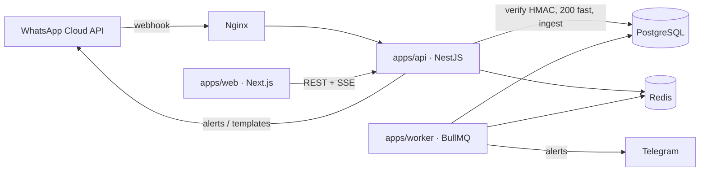

# CLAUDE.md — Komuta

Source of truth for any agent or engineer working on Komuta. Keep this current
whenever architecture, commands, conventions, or env vars change.

## What Komuta is

Komuta is an internal operations "command center" for Özer Kaya, who owns four
food-service companies (school/university canteens, refectories, a pizza
takeaway, a croissant factory, a café). Employees text their **daily revenue
(ciro)** as plain text to a single WhatsApp Business number. Komuta ingests each
message via the Meta WhatsApp Cloud API webhook, **parses** the amount (any
Turkish/Western number format), **routes** it to the correct outlet (by sender
phone, store code, or fuzzy store/employee name), **stores** it, and surfaces
everything in role-based dashboards. The accountant (Salih) enters monthly data
(salaries, purchases, headcount, student counts, inventory). The system monitors
which outlets haven't reported and alerts via in-app / Telegram / WhatsApp.

## Architecture



- **packages/money** — pure, framework-free amount parser + message extractor +
  Turkish normalizer. ~100% tested. Determinism over cleverness.
- **packages/shared** — domain enums, RBAC permissions, **resolution engine**
  (pure decision table), zod schemas, TR/EN i18n catalog.
- **packages/config** — brand + non-secret constants.
- **apps/api** — NestJS REST API, WhatsApp webhook, ingestion pipeline, SSE.
- **apps/worker** — BullMQ background jobs (daily missing-revenue scan).
- **apps/web** — Next.js App Router dashboard (Turkish UI).

### Where each engine lives
| Concern | Location |
| --- | --- |
| Amount parsing | `packages/money/src/parseAmount.ts` |
| Message extraction | `packages/money/src/extractMessage.ts` |
| Turkish normalization | `packages/money/src/normalizeTr.ts` |
| Store resolution + decision table | `packages/shared/src/resolution.ts` |
| RBAC permissions | `packages/shared/src/permissions.ts` |
| Ingestion pipeline | `apps/api/src/whatsapp/ingestion.service.ts` |
| Webhook (verify + HMAC) | `apps/api/src/whatsapp/whatsapp.controller.ts` |
| Outbound (24h window) | `apps/api/src/whatsapp/outbound.service.ts` |
| Dashboard aggregation | `apps/api/src/dashboard/dashboard.service.ts` |
| Monitor matrix | `apps/api/src/monitor/monitor.service.ts` |
| Notifications | `apps/api/src/notifications/` |
| Scheduled jobs | `apps/worker/src/jobs/` |

### WhatsApp pipeline flow
1. Meta POSTs to `/webhooks/whatsapp`. The API verifies `X-Hub-Signature-256`
   (HMAC with `META_APP_SECRET`), responds **200 immediately**, then processes
   in the background. Processing is **idempotent** (dedupe by `waMessageId`;
   concurrent duplicates are caught via the unique constraint / P2002).
   When `WHATSAPP_PHONE_NUMBER_ID` is set, messages whose
   `metadata.phone_number_id` differs are skipped (shared-WABA filtering).
2. `extractMessage(body)` → amount + prefix tokens (WhatsApp formatting chars
   `*_~()` stripped; negative amounts rejected).
3. Sender phone → `PhoneMapping` (ACTIVE) → mapped outlet ids.
4. `resolveStoreFromTokens(prefix, outlets, employees)` → store from code/alias/
   token-subset alias/fuzzy/employee.
5. `decideResolution(...)` applies the §6.4 decision table → status + action.
   `senderBlocked` (BLOCKED `PhoneMapping`) short-circuits to the **BLOCKED**
   `ResolutionStatus`: log only — no revenue, no pending mapping, no alert.
   AMBIGUOUS and NEEDS_* cases dispatch manager alerts.
6. Persist `WhatsAppMessage`, update 24h window, store `RevenueEntry`
   (CONFIRMED supersedes the prior confirmed entry for that outlet/day), create
   a PENDING mapping for unknown→resolvable senders, and dispatch alerts.
   Mapping approval (`POST /mappings/approve`) confirms only entries that
   originated from the approved sender's own messages.

## Commands

```bash
pnpm install                # install workspace
pnpm dev                    # turbo: run api + web + worker in watch mode
pnpm build                  # build all packages/apps
pnpm test                   # run all tests
pnpm lint                   # lint all
pnpm typecheck              # typecheck all

# Database (apps/api)
docker compose -f docker-compose.dev.yml up -d   # local postgres + redis
pnpm db:migrate             # create/apply migration (dev)
pnpm db:deploy              # apply migrations (prod)
pnpm db:seed                # seed demo data (prints login credentials)
pnpm db:generate            # regenerate Prisma client
pnpm --filter @komuta/api db:purge-demo -- --dry-run  # preview demo-data removal
pnpm --filter @komuta/api db:purge-demo               # delete seed/demo data
```

`db:purge-demo` removes seed-generated fake data (revenue with no WhatsApp
message id, null-entered accounting rows, demo mappings/employee/users,
in-app notifications) while keeping companies, outlets, real users and all
real WhatsApp-sourced data. In the prod container:
`docker compose exec -T api npx --yes tsx prisma/purge-demo.ts [--dry-run]`.

Per-package: `pnpm --filter @komuta/<name> <script>`.

## Conventions

- TypeScript strict everywhere. ESM (`"type":"module"`) across all packages and
  apps; relative imports use explicit `.js` extensions (NodeNext).
- Code/comments/commits/docs in **English**. UI + user-facing strings in
  **Turkish** via the `@komuta/shared` i18n catalog (TR primary, EN secondary).
- Validation with **zod** (shared schemas); never trust raw input.
- Money handled as `Decimal` / fixed-2dp strings — never floats for storage.
- Idempotency on all webhook/ingestion paths (dedupe by WhatsApp message id).
- Conventional Commits (`feat:`, `fix:`, `chore:`, `docs:`, `test:`,
  `refactor:`). Small, frequent commits; push every ~5–10.
- Branch: develop on `claude/upbeat-tesla-bmhqav`.

## RBAC (resource:action)
Roles map to permission sets in `packages/shared/src/permissions.ts`, with
per-user grants/revokes and `UserScope` (company/outlet) enforced on queries.
- **OWNER** — everything, all companies.
- **ADMIN** — everything except `company:delete`.
- **ACCOUNTANT (Salih)** — user/company/outlet/brand create + payroll/purchases/
  inventory/studentCount/headcount writes + read dashboards.
- **MANAGER** — read + approve mappings + send messages, scoped.
- **VIEWER** — read-only, scoped.

`canAssignRole(actor, target)` gates `POST /users`: the target role may never
outrank the actor's, and only an OWNER can create another OWNER. WhatsApp
message templates are managed via `GET/POST /templates` (+ `POST
/templates/:id/status`), guarded by `template:manage` (OWNER/ADMIN).

## Adding a new company / outlet
- API: `POST /companies` (perm `company:create`), `POST /companies/brand`,
  `POST /outlets` (`outlet:create`), `POST /outlets/alias` (`alias:write`).
  Aliases are stored with a Turkish-normalized form for matching.
- Or add to `apps/api/prisma/seed.ts` and re-seed.
- **Full admin CRUD** exists for org + users + data (all from the web UI):
  - Users: `GET/POST/PATCH/DELETE /users`, `POST /users/:id/reset-password`,
    `GET /users/permissions`; users carry `phoneE164` for WhatsApp alerts;
    `canAssignRole` blocks privilege escalation; last-OWNER + self-guards.
  - Company/brand/outlet: `PATCH/DELETE` with 409s while children exist;
    outlet delete is **soft** when operational data exists (isActive=false),
    hard otherwise.
  - Employees: `GET/POST/PATCH/DELETE /employees`.
  - Mappings: manual `POST/PATCH/DELETE /mappings` in addition to approve/reject.
  - Data management: `GET /revenue` (filters + `{items,total}` pagination),
    `PATCH/DELETE /revenue/:id`, plus `GET/PATCH/DELETE /accounting/*/:id`.
  - Web: `/ayarlar` (users + permission editor), `/firmalar` (company/brand/
    outlet create-edit-delete), `/sube/[outlet]` tabs Genel / Veriler
    (editable revenue + accounting) / Şube Ayarları (fields, aliases,
    employees, WhatsApp numbers, danger zone), `/eslestirme` (full mapping mgmt).

## Environment variables
See `.env.example` for the authoritative list. Summary:

| Var | Purpose |
| --- | --- |
| `NODE_ENV`, `APP_URL`, `API_URL`, `WEB_PORT`, `API_PORT` | runtime |
| `DATABASE_URL` | PostgreSQL connection |
| `REDIS_URL` | Redis / BullMQ |
| `JWT_ACCESS_SECRET`, `JWT_REFRESH_SECRET`, `JWT_ACCESS_TTL`, `JWT_REFRESH_TTL` | auth tokens |
| `COOKIE_DOMAIN`, `CORS_ORIGIN` | cookie/CORS |
| `META_GRAPH_VERSION` (v23.0), `META_APP_ID`, `META_APP_SECRET`, `META_VERIFY_TOKEN` | Meta app/webhook |
| `WHATSAPP_PHONE_NUMBER_ID`, `WHATSAPP_BUSINESS_ACCOUNT_ID`, `WHATSAPP_ACCESS_TOKEN` | WhatsApp Cloud API |
| `TELEGRAM_BOT_TOKEN`, `TELEGRAM_DEFAULT_CHAT_ID` | Telegram alerts |
| `REPORTING_CUTOFF_LOCAL` (21:00), `DEFAULT_TIMEZONE` (Europe/Istanbul), `ANOMALY_THRESHOLD_PCT` | ops |
| `BACKUP_ENCRYPTION_KEY` | encrypted DB backups |
| `SEED_OWNER_*`, `SEED_ACCOUNTANT_*` | dev seed credentials |

No secret is ever committed; `.env` is git-ignored and `.env.example` stays
complete.

## Gotchas
- The API is **ESM NestJS**. Do not import CommonJS-only packages without
  interop; keep `.js` extensions on relative imports.
- Validation uses zod via `ZodPipe`, not class-validator (the global Nest
  `ValidationPipe` is intentionally not used).
- WhatsApp free-form replies are only allowed inside the **24h service window**
  (the contact messaged us first). Outside it, a UTILITY **template** is used.
  `OutboundService.sendMessage()` auto-selects.
- **Shared-WABA setups REQUIRE `WHATSAPP_PHONE_NUMBER_ID` set** — the webhook
  receives every number's traffic on the WABA; without the filter Komuta would
  ingest other businesses' messages. See `docs/04_META_WHATSAPP_SETUP.md` §0
  (fast path for the shared BakirKupa WABA).
- Refresh tokens are stored (argon2-hashed, keyed by `jti`), **rotated on
  every `/auth/refresh`**, and reuse of a rotated token revokes the whole
  family (theft detection). Logout/password change revokes all of a user's
  refresh tokens.
- Auth via `Authorization: Bearer` everywhere, with ONE exception: the SSE
  route `GET /notifications/stream` is marked `@AllowTokenQuery()` and also
  accepts the access JWT as `?token=` (browser EventSource cannot set
  headers). Never add `@AllowTokenQuery()` to other routes.
- Throttling: global default plus per-route overrides — login 10/min,
  refresh 30/min, webhook 600/min, keyed by real client IP (`trust proxy` is
  set to 1; the API sits behind Nginx).
- Ingestion currently runs **in-process in the background** after a fast 200
  (idempotent). It can be moved onto the BullMQ queue without changing the pure
  pipeline. See `docs/DECISIONS.md`.
- `businessDate` is computed in the outlet's timezone (default Europe/Istanbul).
- At most one CONFIRMED `RevenueEntry` per (outlet, day); corrections supersede.
- Production domain is **panora.live** (nginx, certbot, docs, healthcheck all
  reference it).

## Docs
`/docs` contains setup, local dev, Contabo deployment, domain/SSL, Meta WhatsApp
setup, templates, Telegram, the Turkish user guide, the operations runbook,
backup/restore, architecture, ADRs (`DECISIONS.md`) and the human
`SETUP_CHECKLIST.md`.
