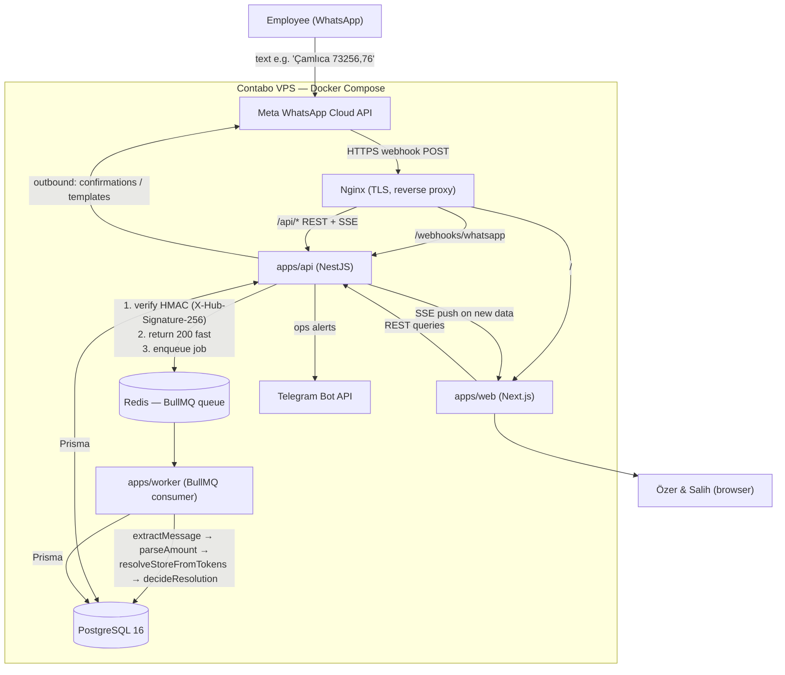

# Architecture

This document explains how Komuta is built internally: the components, how data flows
from a WhatsApp message to a dashboard, and why the responsibilities are split the way
they are. For the rationale behind each major choice, see
[`DECISIONS.md`](./DECISIONS.md).

---

## 1. Component diagram

---

## 2. Separation of concerns

Komuta is a **pnpm + Turborepo monorepo**. Each piece has one job.

| Workspace            | Responsibility                                                                                  |
|----------------------|-------------------------------------------------------------------------------------------------|
| **apps/api** (NestJS)| Public surface: REST API, auth + RBAC guards, the WhatsApp webhook, SSE stream, outbound sends. Its webhook handler does the bare minimum (verify signature, ack 200, enqueue) and returns fast. |
| **apps/worker** (BullMQ)| All the heavy/async message processing. Pulls jobs off Redis and runs the pipeline. Keeping this out of the request path means a slow parse never makes Meta time out the webhook. |
| **apps/web** (Next.js)| The UI only. Talks to the API over REST + SSE; holds no business logic of its own.             |
| **packages/money**   | The deterministic **amount parser** — framework-free, 100% tested. The single source of truth for "what number did the employee mean?". |
| **packages/shared**  | Enums, Zod schemas, the i18n catalog (TR-primary), and the **store-resolution** engine (`resolveStoreFromTokens`, `decideResolution`). |
| **packages/config**  | Brand/company/outlet constants (the 4 companies → brands → outlets).                            |

**Why split api and worker?** WhatsApp expects a fast HTTP `200` on the webhook, or it
retries. So the API does just enough to be safe and fast, then hands off to the worker
via the queue. This also lets us **scale the worker independently**
(`docker compose up -d --scale worker=N`).

---

## 3. Data flow, end to end

1. **Employee → Meta → Nginx → api.** A plain-text WhatsApp message arrives as an HTTPS
   `POST` to `/webhooks/whatsapp`, proxied by Nginx to the api.
2. **api webhook:**
   - Verifies the **`X-Hub-Signature-256`** HMAC using `META_APP_SECRET`. Bad signature →
     reject.
   - Checks the WhatsApp **message id** for **idempotency** (already seen → ack and stop).
   - Returns **`200` immediately** so Meta is satisfied.
   - **Enqueues** a job onto the BullMQ queue in Redis.
3. **worker pipeline** (per job):
   - **`extractMessage`** — pull the sender (`wa_id`), text body, timestamp, message id
     out of the webhook payload.
   - **`parseAmount`** (packages/money) — turn the text into an exact money value,
     handling `73256,76` / `73.256,76` / `73256.76` / `73,256.76`.
   - **`resolveStoreFromTokens`** (packages/shared) — figure out which outlet this is:
     by known sender→outlet mapping, by a leading **store code** (`1234 ...`), or by a
     **name token** (`Çamlıca ...`).
   - **`decideResolution`** (packages/shared) — apply the decision table (below) to
     decide: record it, ask for clarification, or hold for human confirmation.
   - **persist** the revenue record (and any resolution state) to Postgres via Prisma.
4. **api → web.** When new data lands, the api pushes an **SSE** event; the Next.js
   dashboard updates live. The web app also pulls history via REST.
5. **outbound.** The api sends the employee a confirmation (free, inside the 24h window),
   reminders/templates when needed, and **Telegram** alerts to operators.

---

## 4. The money engine (determinism)

`packages/money` is intentionally a **standalone, framework-free** package with **100%
test coverage**. Reasons:

- Money parsing is the highest-stakes logic in the system — a misread comma changes the
  recorded revenue.
- It must be **deterministic**: the same input string always yields the same exact value
  (no floating-point surprises — amounts are handled as integer minor units / a precise
  decimal representation).
- Being framework-free means it can be unit-tested exhaustively and reused by both the
  api and the worker without dragging in NestJS or Next.js.

It accepts both Turkish (`,` decimal) and Anglo (`.` decimal) conventions, plus an
optional leading **store token** (code or name) that the resolver consumes separately.

---

## 5. Resolution decision table (summary)

`resolveStoreFromTokens` + `decideResolution` map an incoming message to an outlet and an
action. In summary:

| Sender known? | Token in message       | Outcome                                                        |
|---------------|------------------------|----------------------------------------------------------------|
| Yes (1 outlet)| none                   | **Record** to the sender's outlet automatically.               |
| Yes (multi)   | valid code/name        | **Record** to the token-matched outlet.                        |
| Yes (multi)   | missing/ambiguous      | **Ask** (`store_id_request`) which outlet.                     |
| No (new sender)| valid code/name       | **Hold for confirmation** (manager_confirmation) → "Onay Bekliyor". |
| No (new sender)| none                   | **Hold for confirmation**; suggest best guess.                 |
| Any           | amount unparseable     | **Reject / ask to resend** with a valid amount.                |

The UI surfaces these as colors on the Monitor page: green = recorded, red = missing,
yellow = awaiting confirmation (see [`07_USER_GUIDE_TR.md`](./07_USER_GUIDE_TR.md)).

---

## 6. Prisma entities (high level)

The exact schema lives in the api workspace's Prisma schema. Conceptually, the data model
includes:

| Entity (conceptual)   | Purpose                                                                 |
|-----------------------|--------------------------------------------------------------------------|
| **Company** (Firma)   | One of the 4 legal entities.                                            |
| **Brand**             | A brand owned by a company.                                            |
| **Outlet** (Şube)     | A revenue-reporting location (canteen/refectory/café/factory).         |
| **Sender**            | A WhatsApp contact (`wa_id`) and its mapping to an outlet.             |
| **RevenueEntry**      | A daily ciro record (amount, date, outlet, source message).            |
| **MonthlyMetric**     | Monthly Stok / Personel Maaşı / Mal Alım / student & employee counts.  |
| **InboundMessage**    | Raw inbound message + WhatsApp message id (for idempotency/audit).      |
| **Resolution**        | Pending/confirmed sender→outlet decisions (the yellow "Onay Bekliyor").|
| **MessageTemplate**   | Approved WhatsApp template mapping (key → metaName/language).           |
| **User**              | Panel users (Özer, Salih) with roles.                                  |
| **Role / Permission** | RBAC: `resource:action` permissions, role map, per-user overrides, scope. |
| **AuditLog**          | Who changed what, when.                                                |

---

## 7. Cross-cutting concerns

- **Auth & RBAC** — JWT access/refresh (`JWT_*` env), permissions as `resource:action`
  with a role map plus per-user overrides and scope (see ADR-0004 in
  [`DECISIONS.md`](./DECISIONS.md)).
- **i18n** — Turkish-primary catalog in `packages/shared` (ADR-0005).
- **Idempotency** — dedupe by WhatsApp message id (ADR-0003).
- **Time** — `DEFAULT_TIMEZONE=Europe/Istanbul`; the missing-revenue cutoff is
  `REPORTING_CUTOFF_LOCAL`.
- **Anomaly detection** — entries deviating more than `ANOMALY_THRESHOLD_PCT` from the
  trailing average are flagged (and can alert via Telegram).
- **Graph API version** pinned via `META_GRAPH_VERSION` (ADR-0006).
